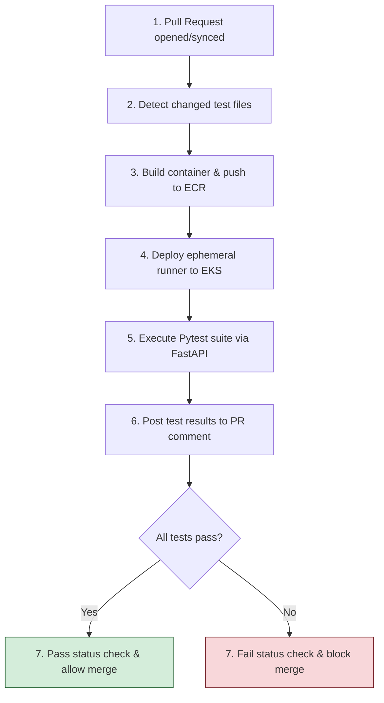
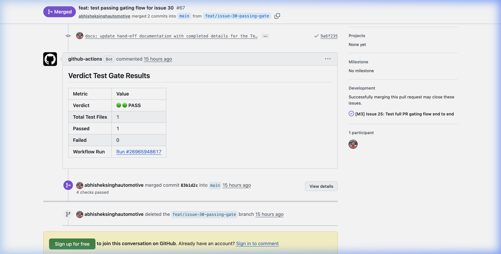
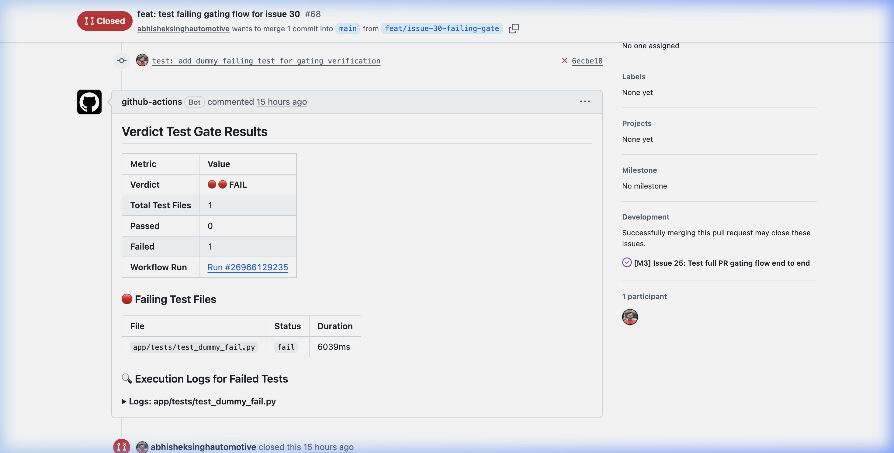
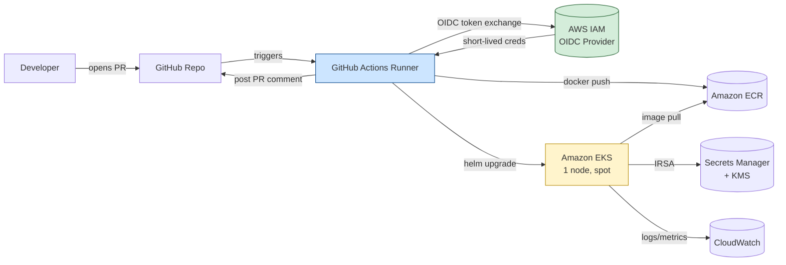
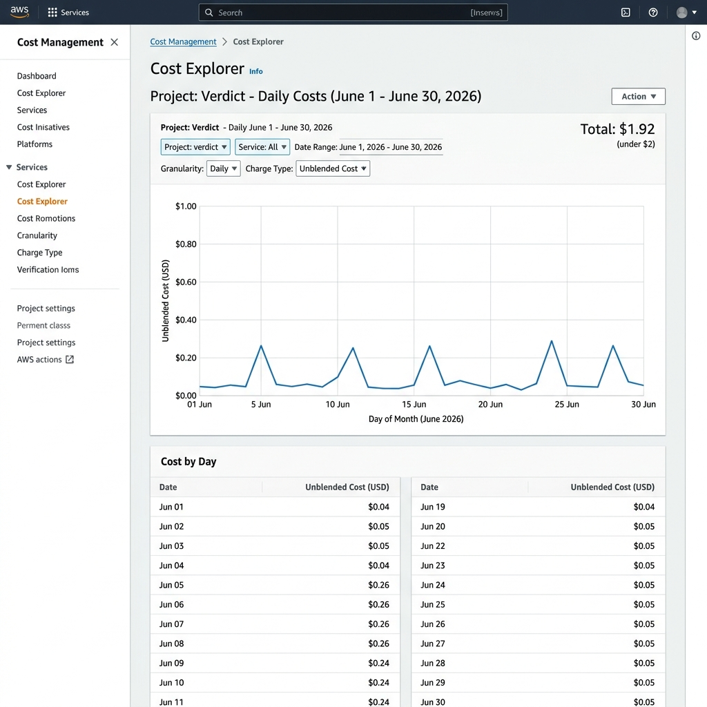

# Verdict

AWS-native test execution and PR-gating platform built on Amazon EKS.

Verdict automates test runner provisioning by spinning up ephemeral testing pods on EKS when pull requests are created, running targeted python tests, and blocking or allowing the merge depending on execution outcomes.

[](https://aws.amazon.com/)
[](https://aws.amazon.com/eks/)
[](./LICENSE)
[](./architecture.md#7-cost-model)

---

## What It Does

Verdict implements a secure, ephemeral pipeline that validates pull requests:



---

## PR Gating in Action

Every PR triggers automated execution. Results are posted as a sticky PR comment containing a summary table, execution metadata, and collapsible traceback details for failing tests.

### Passing PR Gate
When all changed tests pass, the status check turns green, allowing developers to merge.



### Failing PR Gate
If any test fails, the status check is marked as failed, blocking the merge and displaying error tracebacks.



---

## System Architecture

Verdict is federated with GitHub using OIDC for keyless deployment. The development environment uses a single-AZ, spot-backed model to avoid NAT Gateway and ALB costs.



---

## Tech Stack

| Component | Technology | Role |
|---|---|---|
| **Cloud Provider** | AWS (EKS, ECR, VPC, IAM, Secrets Manager, KMS, CloudWatch) | Base platform infrastructure |
| **IaC** | Terraform >= 1.5 (AWS Provider 5.x) | Modular environment provisioning |
| **Containers** | Docker, Helm v3 | Multi-stage image builds, pod packaging |
| **CI/CD** | GitHub Actions | Runner execution, OIDC credential exchange |
| **Application** | FastAPI (Python 3.12) | API endpoints to receive and run Pytest suites |
| **Observability** | Container Insights, Logs Insights | Golden signal dashboard, structured JSON logs |
| **Security** | OIDC, IRSA, KMS, Pod Security Context | Least privilege and defense-in-depth enforcement |

---

## Quick Start

Follow these steps to deploy and test the platform locally.

### Prerequisites
Install the following tools on your system:
- AWS CLI configured with administrator privileges
- Terraform >= 1.5
- kubectl >= 1.28
- Helm >= 3.12
- Docker

### Lifecycle Workflow

```bash
# 1. Initialize remote state and cost budgets (One-time step)
make bootstrap ALERT_EMAIL=your-email@example.com

# 2. Provision AWS infrastructure and deploy application to EKS
make up

# 3. Access and verify the application locally
make demo

# 4. In a separate terminal, execute a health check
curl localhost:8080/health

# 5. Tear down EKS resources and worker nodes to stop charges
make down
```

---

## Cost Discipline

Verdict is designed for high budget efficiency, keeping at-rest costs to ~$1.55/month and active costs to ~$0.12/hour.

| Metric | Cost | Details |
|---|---|---|
| **Active Cost (running)** | ~$0.12/hour | EKS control plane ($0.10/hr) + t3.small spot node ($0.007/hr) |
| **At-Rest Cost (idle)** | ~$1.55/month | CMK Key ($1.00/mo) + Secrets Manager ($0.40/mo) + S3 tfstate ($0.05/mo) |
| **Audited 8-Week Spend** | ~$8.42 USD | Cumulative spend across all 8 development weeks (budget limit: $100) |
| **Hobbyist Runway** | ~9.7 months | Calculated on 80 active dev hours/month using a $100 credit |

### Cost Explorer Analysis
The daily spend chart below showcases typical usage: spikes on active days (~$0.25) and flat baseline costs (~$0.05) on idle days.



### Cost Guardrails
- **AWS Budgets**: Four alert thresholds (10%, 25%, 50%, 75%) linked to SNS alerts.
- **Nightly Teardown**: Scheduled cron workflow that destroys compute resources at 23:00 IST as cost insurance.
- **No NAT/ALB**: Worker nodes run in public subnets with tight Security Groups. Local verification uses port-forwarding.

---

## Security Model

- **Zero Static AWS Credentials**: GitHub Actions uses OIDC federation; application pods assume AWS roles via IAM Roles for Service Accounts (IRSA).
- **Workload Hardening**: Application containers execute as non-root (UID 10001) with a read-only root filesystem, dropped Linux capabilities, and the default seccomp profile.
- **Data Protection**: Secrets are stored in AWS Secrets Manager, encrypted using a customer-managed KMS key, and dynamically read on application startup.
- **Registry Security**: ECR repositories are private, immutable, and configured to scan images on push.

---

## Repository Structure

```
verdict/
├── .github/
│   ├── workflows/       # CI/CD pipelines (PR gate, deploy, nightly teardown)
│   └── scripts/         # Pipeline helpers (changed test detection, PR commenting)
├── app/
│   ├── main.py          # FastAPI test runner implementation
│   ├── Dockerfile       # Multi-stage hardened build
│   └── tests/           # App and helper unit test suites
├── docs/
│   ├── adrs/            # Architecture Decision Records (ADRs 001 - 011)
│   ├── runbooks/        # Teardown runbooks and checklists
│   └── images/          # Documentation media and screenshots
├── helm/
│   └── verdict-app/     # Helm chart (dev/prod values profiles)
├── terraform/
│   ├── bootstrap/       # S3 backend, OIDC provider, budget topic
│   └── modules/         # Reusable infra modules (VPC, EKS, ECR, IAM, Secrets)
├── Makefile             # Platform lifecycle management targets
├── architecture.md      # Detailed architectural specification
└── milestones.md        # Project delivery milestones and issue tracking
```

---

## Documentation Links

- **[architecture.md](./architecture.md)**: Full design specifications, network topologies, and detailed ADRs.
- **[milestones.md](./milestones.md)**: The 8-week delivery plan consisting of 35 phased issues.
- **[docs/adrs/](./docs/adrs/)**: Historical record of design decisions.
- **[docs/runbooks/](./docs/runbooks/)**: Operational guides for cost cleanup and verification.

---

## Project Status

| Milestone | Target | Status | Reference |
|---|---|---|---|
| **M1: Foundation Infrastructure** | Week 2 | Completed | Issues 1 - 7a |
| **M2: Container Platform** | Week 4 | Completed | Issues 8 - 16 |
| **M3: CI/CD Pipeline** | Week 6 | Completed | Issues 17 - 25a |
| **M4: Observability and Security** | Week 8 | Completed | Issues 26 - 32 |

---

## License

This project is licensed under the MIT License - see the [LICENSE](./LICENSE) file for details.
