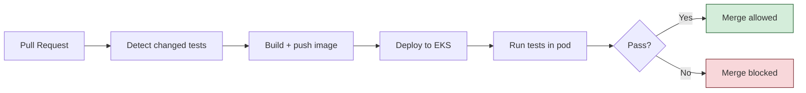

# Verdict

> Cloud-native PR-gating test execution platform on AWS.
> Open a PR, get a verdict in under 3 minutes — automatic test detection, ephemeral EKS execution, merge blocked on failure.

[]()
[]()
[]()

---

## What It Does



1. Developer opens a PR
2. GitHub Actions detects changed `test_*.py` files
3. Workflow builds the image, deploys to EKS via Helm
4. Test runner pod executes only the changed tests
5. Results posted as a PR comment; status check gates merge

---

## Tech Stack

| Layer | Tooling |
|---|---|
| Cloud | AWS (EKS, ECR, VPC, IAM, Secrets Manager, KMS, CloudWatch) |
| IaC | Terraform (modular, remote state) |
| Containers | Docker (multi-stage, non-root), Helm |
| CI/CD | GitHub Actions, OIDC federation |
| App | FastAPI (Python 3.12) |
| Observability | CloudWatch Container Insights, structured JSON logs |
| Security | IRSA, OIDC, KMS, pod hardening, ECR scan-on-push |

---

## Quick Start

```bash
# One-time setup (S3 tfstate, OIDC, Budget alarms)
make bootstrap

# Bring the stack live (EKS + app, ~$0.12/hr)
make up

# Verify
kubectl port-forward -n verdict svc/verdict-app 8080:80
curl localhost:8080/health

# Tear down (back to ~$1/mo)
make down
```

**Prerequisites:** AWS CLI, Terraform >= 1.5, kubectl >= 1.28, Helm >= 3.12, Docker.

---

## Cost Discipline

Built to run on a **$100 AWS credit** for ~9 months at 80 active hrs/mo.

| State | Cost |
|---|---|
| Active (running) | ~$0.12/hr |
| At rest (destroyed) | ~$1/mo |
| 80 active hrs/mo | ~$10/mo |

Cost guardrails enforced by:
- AWS Budgets at $10 / $25 / $50 / $75 with email alerts
- Spot instances, single AZ, no NAT Gateway, no ALB at rest
- `make down` as the standard session-end reflex
- Nightly teardown workflow as safety net

---

## Security Highlights

- **Zero static AWS credentials.** GitHub Actions uses OIDC federation; pods use IRSA.
- **Scoped trust policies.** IAM role trust restricted to specific repo and service account.
- **Secrets in Secrets Manager.** Encrypted with customer-managed KMS key, read via IRSA.
- **Hardened pods.** Non-root, read-only filesystem, all capabilities dropped, seccomp default.
- **Image scanning.** ECR scan-on-push, immutable tags.

---

## Repository Layout

```
verdict/
├── terraform/      # VPC, EKS, ECR, IAM, Secrets modules
├── app/            # FastAPI test runner
├── helm/           # Helm chart with dev and prod values
├── .github/        # Workflows + scripts
├── docs/           # ADRs and runbooks
├── architecture.md # Full architecture documentation
├── milestones.md   # Implementation plan (8 weeks, 35 issues)
└── Makefile        # Lifecycle commands
```

---

## Documentation

- **[architecture.md](./architecture.md)** — Full system design, diagrams, ADRs, cost model
- **[milestones.md](./milestones.md)** — 8-week implementation plan with all issues
- **[docs/adrs/](./docs/adrs/)** — Architecture Decision Records
- **[docs/runbooks/](./docs/runbooks/)** — Cost controls and teardown checklist

---

## Status

| Milestone | Due | Status |
|---|---|---|
| 1. Foundation Infrastructure | Week 2 | Completed |
| 2. Container Platform | Week 4 | Completed |
| 3. CI/CD Pipeline | Week 6 | In progress |
| 4. Observability and Security | Week 8 | Not started |

---

## License

MIT
