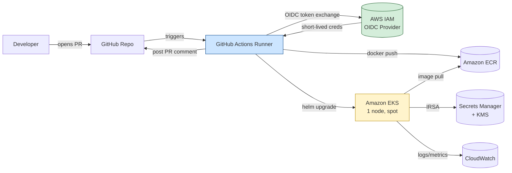
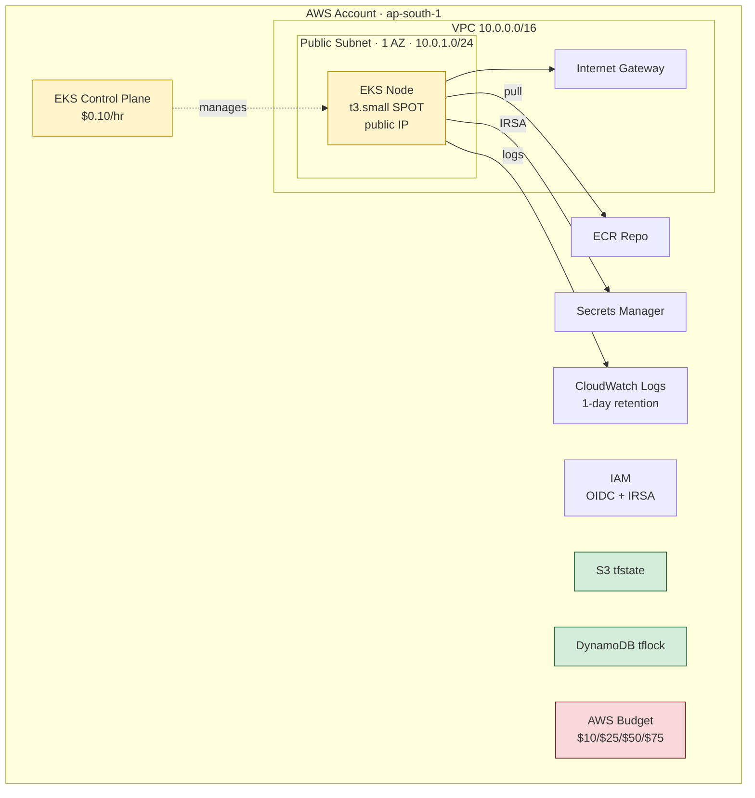
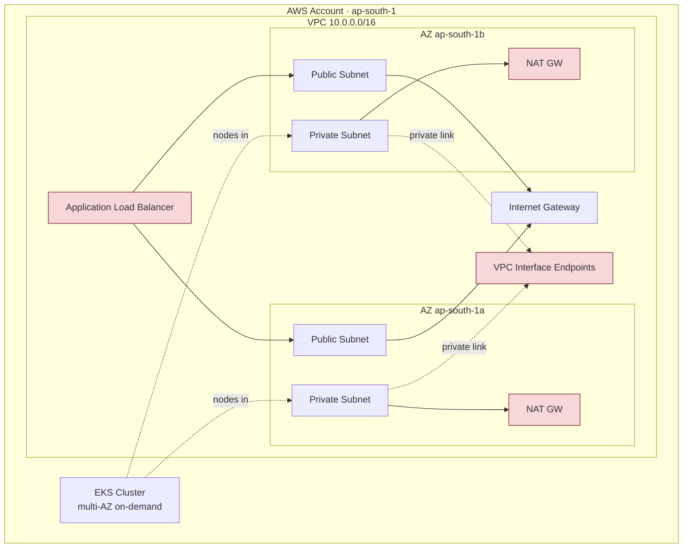
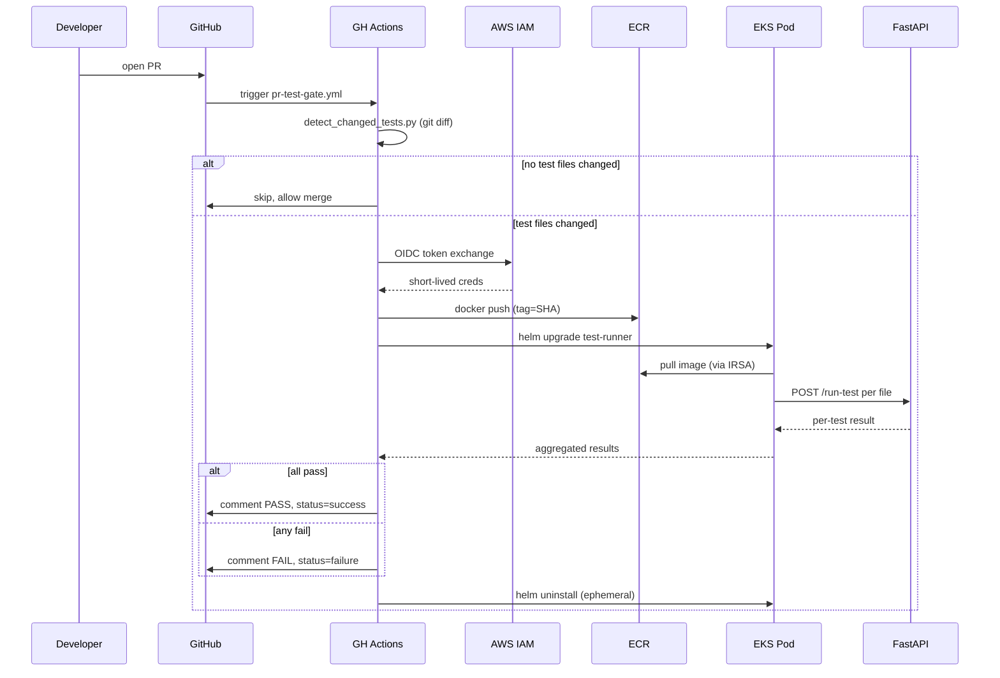
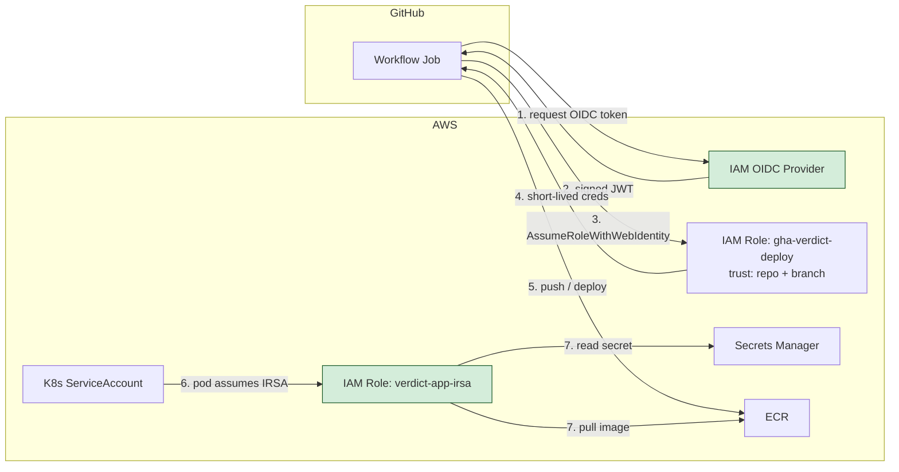
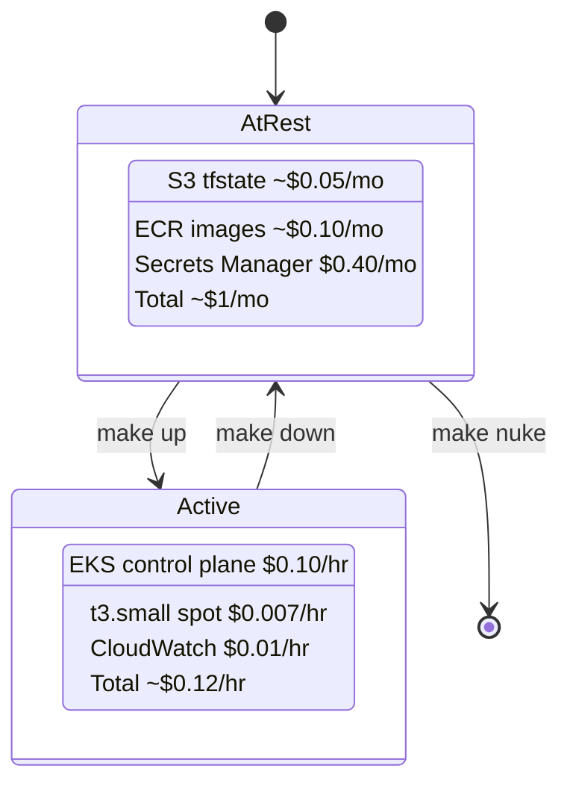

# Architecture

**Project:** verdict
**Version:** 1.0.0
**Last Updated:** 2026-06-03
**Author:** Abhishek Singh

---

## Table of Contents

1. [Overview](#1-overview)
2. [Design Principles](#2-design-principles)
3. [System Architecture](#3-system-architecture)
4. [Deployment Topology](#4-deployment-topology)
5. [PR Gating Flow](#5-pr-gating-flow)
6. [Security Model](#6-security-model)
7. [Cost Model](#7-cost-model)
8. [Component Inventory](#8-component-inventory)
9. [Operational Lifecycle](#9-operational-lifecycle)
10. [Repository Layout](#10-repository-layout)
11. [Architecture Decision Records](#11-architecture-decision-records)

---

## 1. Overview

Verdict is a cloud-native PR-gating test execution platform on AWS. When a developer opens a pull request, GitHub Actions detects changed test files, executes them in isolated containers on Amazon EKS, and blocks or approves the merge based on results.

The platform operates in two modes:

| Mode | Purpose | Footprint |
|---|---|---|
| **Dev** | Day-to-day development and demos | Single-AZ, spot, no NAT, no ALB |
| **Prod** | Documented reference for scale | Multi-AZ private, NAT, on-demand, ALB |

Only Dev is deployed. Prod exists as Terraform variables and ADRs to demonstrate the design at scale.

---

## 2. Design Principles

| # | Principle | Rationale |
|---|---|---|
| 1 | Ephemeral by default | `make up` brings the stack live, `make down` returns to ~$1/mo |
| 2 | One AZ for dev, multi-AZ in code | Same module serves both; tfvars decides spend |
| 3 | Public subnet, no NAT in dev | NAT Gateway is $32/mo flat; locked-down SGs replace it |
| 4 | Spot, smallest viable instance | One `t3.small` spot node, ~85% cheaper than on-demand |
| 5 | No ALB at rest | `kubectl port-forward` for dev, ALB only for demo |
| 6 | Aggressive log retention | CloudWatch logs: 1-day dev, 7-day prod |
| 7 | Budget guardrails day one | AWS Budgets at $10 / $25 / $50 / $75 with SNS alerts |
| 8 | No VPC interface endpoints in dev | Each is ~$7.20/mo; public egress via IGW suffices |

---

## 3. System Architecture



GitHub trades an OIDC token for IAM credentials, pushes the image, deploys to EKS, runs the tests, and reports back to the PR. No static credentials anywhere.

---

## 4. Deployment Topology

### 4.1 Dev Mode (Deployed)



| Color | Meaning |
|---|---|
| Green | Persistent and cheap; kept always (~$1/mo total) |
| Yellow | Ephemeral; destroyed between sessions |
| Red | Cost or safety guardrail |

### 4.2 Prod Path (Documented, Not Deployed)



Same Terraform module, different tfvars. Red components are the cost delta vs. dev.

---

## 5. PR Gating Flow



---

## 6. Security Model



### 6.1 GitHub Actions Trust Policy

```json
{
  "Condition": {
    "StringEquals": {
      "token.actions.githubusercontent.com:aud": "sts.amazonaws.com"
    },
    "StringLike": {
      "token.actions.githubusercontent.com:sub":
        "repo:abhisheksinghautomotive/verdict:*"
    }
  }
}
```

### 6.2 Pod Security Context

```yaml
securityContext:
  runAsNonRoot: true
  runAsUser: 10001
  readOnlyRootFilesystem: true
  allowPrivilegeEscalation: false
  capabilities:
    drop: ["ALL"]
  seccompProfile:
    type: RuntimeDefault
```

### 6.3 Defense in Depth

| Layer | Control |
|---|---|
| Identity | OIDC federation, no long-lived AWS keys |
| Authorization | Scoped IAM trust policies (per repo, per service account) |
| Network | Private EKS API endpoint option, security groups, no public DB |
| Workload | Non-root, read-only FS, dropped capabilities, seccomp default |
| Supply chain | ECR scan-on-push, immutable image tags |
| Secrets | Secrets Manager + customer-managed KMS key, read via IRSA |
| Audit | CloudTrail, CloudWatch Logs |

---

## 7. Cost Model

### 7.1 Active Cost (per hour)

| Resource | Hourly |
|---|---|
| EKS control plane | $0.100 |
| 1x t3.small spot | $0.007 |
| CloudWatch logs | $0.010 |
| Data transfer | $0.005 |
| **Total** | **~$0.122/hr** |

### 7.2 At-Rest Cost (per month)

| Resource | Cost |
|---|---|
| S3 tfstate | $0.05 |
| DynamoDB lock | $0.00 |
| ECR images | $0.10 |
| Secrets Manager | $0.40 |
| AWS Budgets | $0.00 |
| **Total** | **~$0.55/mo** |

### 7.3 Budget Runway on $100 Credit

| Usage Pattern | Monthly | Months Runway |
|---|---|---|
| 80 hrs active (heavy dev) | $10.30 | ~9.7 |
| 40 hrs active (steady) | $5.40 | ~18 |
| 10 hrs active (demo only) | $1.80 | ~55 |
| Always-on (anti-pattern) | $87 | ~1.1 |

### 7.4 Cost Lifecycle



---

## 8. Component Inventory

### 8.1 Infrastructure (Terraform)

| Component | Dev | Prod | Module |
|---|---|---|---|
| VPC | 1 AZ, 1 public subnet | 2 AZ, public + private | `modules/vpc` |
| NAT Gateway | OFF | ON | `modules/vpc` (var-gated) |
| EKS Cluster | 1 managed nodegroup | 1 managed nodegroup | `modules/eks` |
| Node Group | 1x t3.small SPOT | 2x t3.medium on-demand | `modules/eks` |
| ALB | OFF (port-forward) | ON | AWS Load Balancer Controller |
| ECR | 1 repo, scan-on-push | same | `modules/ecr` |
| IAM | OIDC + GHA + IRSA | same | `modules/iam` |
| Secrets Manager | 1 secret + CMK | same | `modules/secrets` |
| S3 (tfstate) | versioned | same | `bootstrap/` |
| DynamoDB (tflock) | on-demand | same | `bootstrap/` |
| AWS Budgets | 4 thresholds | same | `modules/budget` |
| VPC Endpoints | OFF | ON (ECR, STS, Secrets) | `modules/vpc` (var-gated) |
| CloudWatch Log Groups | 1-day retention | 7-day retention | `environments/dev/cloudwatch.tf` |
| EKS Addons | CloudWatch Observability | same | `environments/dev/cloudwatch.tf` |
| CloudWatch Dashboard | 6 golden signal widgets | same | `modules/observability` |


### 8.2 Application

| Component | Notes |
|---|---|
| FastAPI app | `/run-test`, `/health`, `/results` endpoints |
| Dockerfile | Multi-stage, slim base, non-root UID 10001 |
| Helm chart | Single chart; `values-dev.yaml` + `values-prod.yaml` |

### 8.3 CI/CD Workflows

| Workflow | Trigger | Purpose |
|---|---|---|
| `pr-test-gate.yml` | PR opened/synced | Detect, run, comment, gate |
| `deploy-infrastructure.yml` | PR (plan), merge (apply) | Terraform lifecycle |
| `build-push-image.yml` | Reusable | Docker build + ECR push |
| `nightly-teardown.yml` | Cron 23:00 IST | Cost insurance |

---

## 9. Operational Lifecycle

```
make bootstrap   # one-time: S3 tfstate, DynamoDB lock, IAM OIDC, Budget
make up          # terraform apply + helm install
make demo        # port-forward 8080:80 (or provision ALB)
make test-gate   # simulate a PR locally
make down        # helm uninstall + terraform destroy (keeps bootstrap)
make nuke        # destroy bootstrap (project archive only)
make cost        # current month spend via Cost Explorer
```

Treat `make down` like `git commit` — run at the end of every session.

---

## 10. Repository Layout

```
verdict/
├── Makefile
├── README.md
├── architecture.md
├── milestones.md
├── docs/
│   ├── adrs/
│   └── runbooks/
├── terraform/
│   ├── bootstrap/
│   ├── modules/
│   │   ├── vpc/
│   │   ├── eks/
│   │   ├── ecr/
│   │   ├── iam/
│   │   ├── secrets/
│   │   └── budget/
│   └── environments/
│       ├── dev/
│       └── prod/
├── app/
│   ├── main.py
│   ├── Dockerfile
│   ├── requirements.txt
│   └── tests/
├── helm/
│   └── verdict-app/
│       ├── Chart.yaml
│       ├── values-dev.yaml
│       ├── values-prod.yaml
│       └── templates/
└── .github/
    ├── workflows/
    └── scripts/
```

---

## 11. Architecture Decision Records

| ADR | Decision | Cost Impact |
|---|---|---|
| 001 | EKS over Fargate / ECS | Retains EKS skill demonstration |
| 002 | OIDC, no static AWS credentials | $0 |
| 003 | IRSA over node-level IAM | $0 |
| 004 | Spot + single AZ in dev | ~99% compute savings |
| 005 | No NAT in dev, public subnet with hardened SG | $32/mo savings |
| 006 | No ALB at rest, on-demand ALB for demo | $18/mo savings |
| 007 | CloudWatch 1-day retention in dev | ~80% log cost savings |
| 008 | Nightly teardown workflow | Caps blast radius |
| 009 | AWS Load Balancer Controller | $0 additional cost in dev |

Full ADRs live in `docs/adrs/`.

---

*Version controlled alongside the codebase. Update when architecture changes.*
